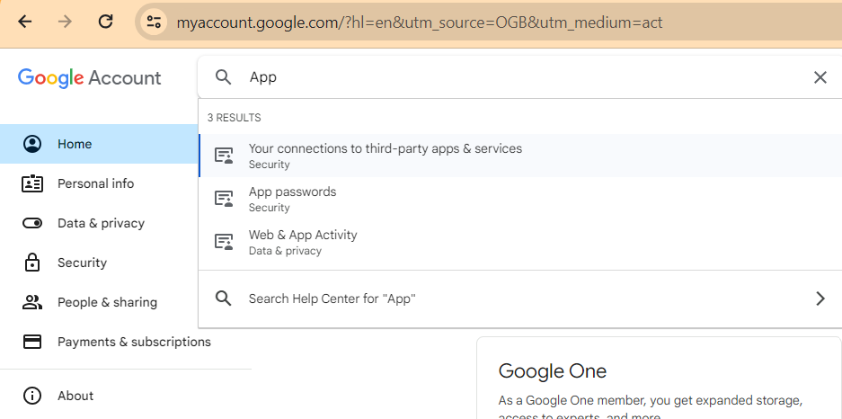
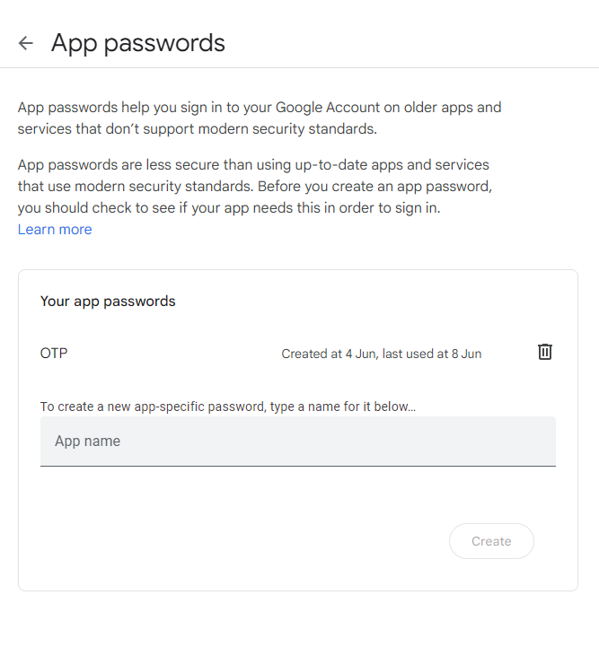
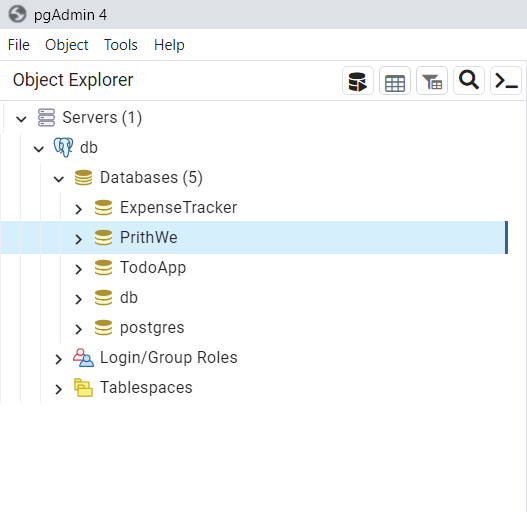
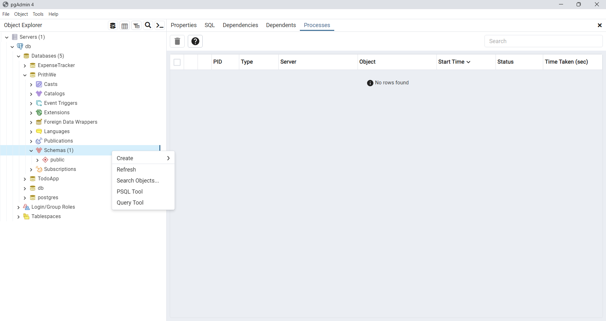

# PrithWe 

PrithWe is a full-stack web application built on the PERN stack (PostgreSQL, Express, React, Node.js) designed to help households and businesses calculate their carbon footprints. This project was developed as a college project to promote environmental awareness and action.

## Table of Contents

- [Introduction](#introduction)
- [Features](#features)
- [Technologies Used](#technologies-used)
- [Installation](#installation)
- [Usage](#usage)
- [Motivation](#motivation)
- [License](#license)

## Introduction

PrithWe allows users to calculate their carbon footprint based on various parameters. It provides detailed insights and suggestions on how to reduce their carbon emissions. The name "PrithWe" is derived from "Prithvi" (Earth) and "We," emphasizing collective action and collaboration.

Visit the live application [here](https://prithwe.onrender.com).

## Features

- User authentication and authorization
- Carbon footprint calculator for households and businesses
- Detailed reports and donut chart representation.
- Responsive design for all devices
- User-friendly interface

## Technologies Used

- **Frontend**: React.js, Tailwind CSS
- **Backend**: Node.js, Express.js
- **Database**: PostgreSQL
- **Hosting**: Render
- **Version Control**: Git, GitHub

## Installation

Follow these steps to set up the project locally:

1. Clone the repository:

   ```bash
   git clone https://github.com/yourusername/prithwe.git
   ```

2. Navigate to the project directory:

   ```bash
   cd prithwe
   ```

3. Install backend dependencies:

   ```bash
   npm install
   ```

4. Install frontend dependencies:

   ```bash
   cd ./client
   npm install
   ```

5. Set up environment variables:

   Create a `.env` file in the `server` directory and add your database details:

   ```env
   PG_USER=your_user_name
   PG_HOST=your_host_name
   PG_DATABASE=your_database_name
   PG_PASSWORD=your_password
   PG_PORT=5432
   SESSION_SECRET=your_secret
   MAIL=your_mail
   APP_PASSWORD=your_app_password
   ADMIN_MAIL=admin_mail
   ADMIN_PASS=admin_password
   GEMINI_API_KEY=your_api_key
   OAUTH_CLIENT_ID=your_client_id
   OAUTH_SECRET=your_secret
   ```

6. Setting up App Password

   PrithWe uses `otp` for verification using gmail while registering and also for resetting password. And the otp is send to the gmail. And google does not allow to send otp directly from a website due to security reasons. For this purpose we use app password.

   Go to Manage your account. And search App. As shown below. And select App Passwords. 

   

   Then create an App password by giving it any name(Ex: Otp) and copy the app password as it will be only shown once.

   

   Then go to `.env` file and paste it as a String under APP_PASSWORD and remove all the space in between.

7. Building the Database Schemas

   After Successfully installing PostgreSql(PgAdmin 4) create a database with any name (Ex: PrithWe) as shown below.
   

   Then inside the created database go to Schemas and right click on it and select Query tools as shown below.
   

   After that paste the below code and run it.

```sql
CREATE EXTENSION IF NOT EXISTS "uuid-ossp";

CREATE TABLE users (
    id UUID PRIMARY KEY DEFAULT uuid_generate_v4(),
    google_id VARCHAR(255),
    name VARCHAR(255) NOT NULL,
    email VARCHAR(255) UNIQUE NOT NULL,
    password VARCHAR(255) NOT NULL,
    type VARCHAR(50) NOT NULL,
    otp VARCHAR(20) DEFAULT '000000',
    otp_timestamp BIGINT,
    isVerified BOOLEAN DEFAULT false,
   created_at TIMESTAMP DEFAULT CURRENT_TIMESTAMP
);

CREATE TABLE contact (
    id SERIAL PRIMARY KEY,
    name VARCHAR(255),
    email VARCHAR(255),
    message TEXT,
    created_at TIMESTAMP DEFAULT CURRENT_TIMESTAMP
);

CREATE TABLE household_common (
    id SERIAL PRIMARY KEY,
    user_id UUID REFERENCES users(id),
    electricity_usage DECIMAL,
    water_usage DECIMAL,
    waste_generation DECIMAL,
    gas_cylinder DECIMAL,
    created_at TIMESTAMP DEFAULT CURRENT_TIMESTAMP
);

CREATE TABLE business_common (
    id SERIAL PRIMARY KEY,
    user_id UUID REFERENCES users(id),
    electricity_usage DECIMAL,
    water_usage DECIMAL,
    paper_consumption DECIMAL,
    waste_generation DECIMAL,
    fuel_consumption DECIMAL,
    business_travel DECIMAL,
    created_at TIMESTAMP DEFAULT CURRENT_TIMESTAMP
);

CREATE TABLE family_members (
    id SERIAL PRIMARY KEY,
    household_common_id INT REFERENCES household_common(id),
    name VARCHAR(255),
    private_vehicle DECIMAL,
    public_vehicle DECIMAL,
    air_travel DECIMAL,
    veg_meals DECIMAL,
    non_veg_meals DECIMAL,
    created_at TIMESTAMP DEFAULT CURRENT_TIMESTAMP
);

CREATE TABLE recommendations (
    id SERIAL PRIMARY KEY,
    user_id UUID,
    household_common_id INT,
    business_common_id INT,
    recommendation TEXT,
    created_at TIMESTAMP DEFAULT CURRENT_TIMESTAMP,
    FOREIGN KEY (user_id) REFERENCES users(id),
    FOREIGN KEY (household_common_id) REFERENCES household_common(id),
    FOREIGN KEY (business_common_id) REFERENCES business_common(id)
);
```
   You will see tables for the database are created automatically.

8. Start the backend server:

   ```bash
   cd ./server
   node index.js
   ```

9. Start the frontend development server:

   ```bash
   cd ./client
   npm run dev
   ```

10. Open your browser and navigate to `http://localhost:5173`.

11. Getting OAuth Client ID and Secret

      Steps to follow -
   
     Go to the [Google Developers Console.](https://console.cloud.google.com/projectselector2/apis/dashboard?pli=1&supportedpurview=project)
     Click Select a project ➝ New Project ➝ the Create button.
     
    
     Enter your Project name ➝ click the Create button.
     
    
     Click OAuth consent screen in the left side menu ➝ choose User Type ➝ click the Create button.
     
    
     Add Application name ➝ Support email ➝ Authorized domain ➝ Developer content information ➝ click the Save and Continue button.
     
    
     Complete all 4 steps in OAuth consent screen ➝ click the Back to Dashboard button.
     
    
     Go to Credentials ➝ click Create Credentials ➝ select OAuth client ID from the dropdown list.
     
    
     Open the dropdown list Application type ➝ select Web application ➝ enter the name of your OAuth 2.0 client.
     
    
     Enter your site URL in Authorized JavaScript origins ➝ in Authorized redirect URIs, enter the page URL where you wanted your users redirected back after they have authenticated with Google ➝ click the 
     Create button.
     
    
     Copy your Client ID and Client Secret.
     
    
     Then go to `.env` file and paste client id & secret in `OAUTH_CLIENT_ID` `OAUTH_SECRET`

## Usage

1. Register a new account or log in with an existing account.
2. Choose whether you want to calculate the carbon footprint for a household or a business.
3. Fill in the required information in the form.
4. View the calculated carbon footprint and suggestions for reducing emissions.

## Motivation

It was a college project and the motivation behind PrithWe is to provide a tool that helps individuals and businesses become more aware of their environmental impact. By understanding their carbon footprint, users can take actionable steps towards reducing their emissions and contributing to a healthier planet.

## License

This project is licensed under the MIT License. See the [LICENSE](LICENSE) file for more details.
